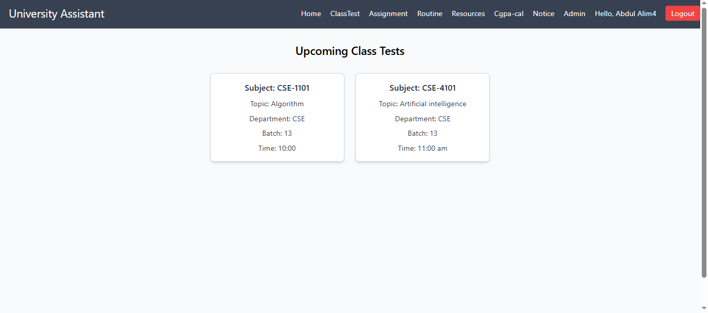

# 🎓 University Assistant

A full-stack University Assistant web application designed to simplify communication between students and teachers, and automate daily academic updates.

---

## 🌐 Repositories

### 🎨 Frontend
👉 [Frontend Repo](https://github.com/ALIM23700/FullstackUniversity_Assistant-Frontend)

### ⚙️ Backend
👉 [Backend Repo](https://github.com/ALIM23700/FullstackEcommers_Backend)

---

## 🌍 Live Demo
👉 [Live Site](https://fullstack-university-assistant-fron.vercel.app/)

---

## 🚀 Problem We Solve

In many universities, teachers receive numerous calls or messages from class representatives just to confirm:

> “Will there be a class tomorrow?”

This creates unnecessary hassle for both teachers and students.

---

## 💡 Our Solution

University Assistant eliminates this problem by:

- 📅 Automatically showing next day’s class schedule
- ✅ Allowing teachers to approve upcoming classes with a single action
- 📢 Instantly updating students through a centralized notice system

---

## ✨ Features

### 👨‍🎓 Student Features

- 📅 View upcoming classes (auto-filtered by date)  
- 📝 Check assignments & class tests  
- 📚 Download academic resources  
- 🧮 CGPA Calculator  
- 🗓️ View class routine  
- 🔔 Next-day class notice  
- 🏫 Department-based information access  
- 🔐 Register & login (Name, Email, Department)  

### 👨‍🏫 Teacher / Admin Features

- ➕ Add upcoming classes, assignments, class tests, and class routines  
- ✏️ Edit or delete only their own content  
- 👁️ View only information they created  
- ✅ Approve next-day classes so they appear automatically on the notice page  
- 🔔 Reduce unnecessary calls or messages from students about class schedules  

---

## 🔐 Authentication & Authorization

- Role-based Authentication system:  
  - 👨‍🎓 Student  
  - 👨‍🏫 Admin / Teacher  
- Secure access control:  
  - Students → View only  
  - Admin / Teacher → Full control over their own data  

---

## 🏗️ Project Architecture

Frontend (React) ↔ Backend (API Server) ↔ Database

---

## 🛠️ Tech Stack

### Frontend

- React.js  
- Tailwind CSS  
- React Router DOM  

### Backend

- Node.js  
- Express.js  

### Database

- MongoDB  

---

## ⚙️ Setup Instructions
This showcase repo does not contain the actual code.  
To run the project locally, please check the individual repositories:

- **Frontend:** [FullstackUniversity_Assistant-Frontend](https://github.com/ALIM23700/FullstackUniversity_Assistant-Frontend)  
- **Backend:** [FullstackEcommers_Backend](https://github.com/ALIM23700/FullstackEcommers_Backend)  

Follow the instructions in each repo to set up and run the project.

---

## 📸 Screenshots

### Home Page
  
*Dashboard showing upcoming classes and notices*

### Class Test
  
*View and track class tests*

### Assignment
  
*View and download assignments*

### Routine
  
*Weekly class routine*

### Resource
  
*Download academic resources*

### CGPA Calculator
  
*Calculate your CGPA easily*

### Next Day Notice
  
*Automatically updated notice for next day class*

### Admin Dashboard
  
  

⭐ Why This Project Stands Out
Solves a real university communication problem
Clean role-based system
Practical automation of daily academic workflow
Clear separation of frontend and backend

👨‍💻 Author
Abdul Alim
GitHub: https://github.com/ALIM23700

⭐ Support

If you like this project, give it a ⭐ on GitHub!
